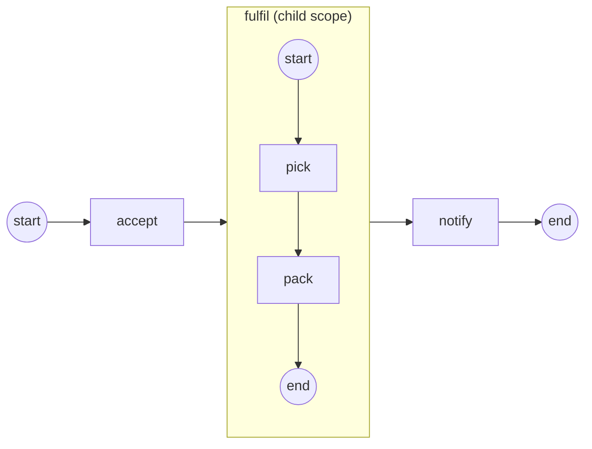

# embedded-subprocess

**Composition: a nested scope inside the instance** — the embedded
Sub-Process (ADR-023 / SRD-049).

The fulfillment fragment `fulfil[ pick → pack ]` is an activity in the
parent's flow AND a container of its own graph. When the token enters it:

- a **child scope opens** (`/embedded-subprocess/sp-…`) and the inner flow
  seeds from the fragment's None Start Event (BPMN §13.3.4);
- inner tasks **read the parent's data** (`order-id`) through the container
  walk-up (§10.5.7), while their own commits (`picked`) stay in the child
  scope and are **disposed at close**;
- the parent's token **parks** on the fragment and resumes only when the
  scope **drains** — no tokens remain inside;
- interruption is scope-wide: a boundary event on the fragment, a Terminate
  End Event inside it, or an Error escaping it cancels the whole scope as a
  unit (the Error walks the scope chain to the innermost enclosing catcher).



`model.go` builds the process, `process.go` the tasks, `observer.go` prints
the scope lifecycle, `main.go` wires + runs.

```bash
go run .
```

```
  accept (sees order-id=4711)
  pick (sees order-id=4711)
  pack (sees order-id=4711)
  ▶ scope fulfil: Opened (/embedded-subprocess/sp-…)
  ▶ scope fulfil: Completed (/embedded-subprocess/sp-…)
  notify (sees order-id=4711)
  ✓ completed (Completed)
```

See [`docs/guides/composition.md`](../../docs/guides/composition.md).
