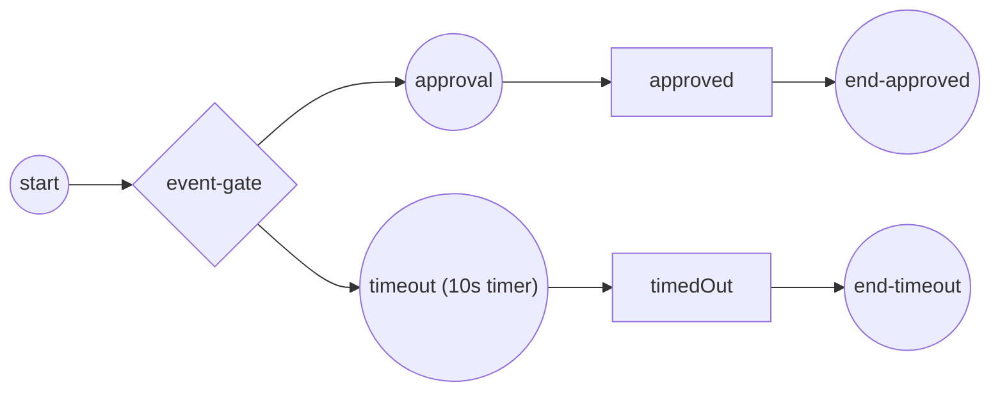

# event-based-gateway

**Mid-flow deferred choice — the first of several events to fire wins; the
rest are dropped** (ADR-005 §2.12).

- the Event-Based gateway subscribes to **both** arms — an `approval`
  message catch and a 10s `timeout` timer catch — and routes the token down
  whichever fires first, dropping the other subscription;
- the demo publishes the approval message after the gate has parked on both
  arms, so the approval arm wins;
- the timer arm is the self-terminating fallback — the run completes even
  if no message ever arrives.



`process.go` builds the process, `main.go` wires the engine, publishes the
approval and runs.

```bash
cd examples/event-based-gateway && go run .
```

```
deferred choice: waiting for an approval message OR a 10s timeout...
  ✓ approval arrived first → order approved
✓ event-based-gateway completed (Completed): the gate fired the arm whose ...
```
