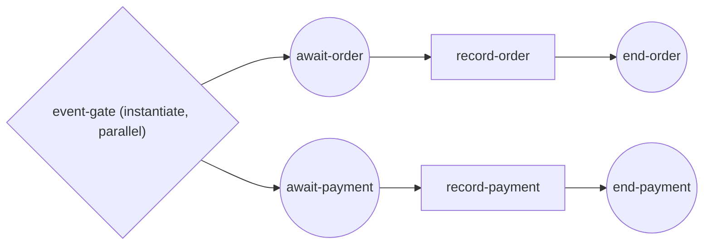

# event-based-parallel-start

**A process started by an event gateway — two correlated messages, one
instance** (parallel instantiating Event-Based gateway, BPMN §13.2).

- the gate has **no incoming flow and no start event**: it is built with
  `WithInstantiate()` + `ParallelEvents`, so the FIRST of its two messages
  creates the instance;
- both arms share one correlation key (`orderId`, derived from either
  message's payload), so the second message **re-arms keyed** to the
  instance the first one created;
- the instance completes only once **both** arms have fired — order placed
  AND payment received;
- the driver never calls `StartProcess` — it discovers the event-born
  instance through the engine's instance-observation API (SRD-019) and
  waits for its completion.



`process.go` builds the process and the correlation key, `fulfill.go`
publishes the two messages and awaits the born instance, `main.go` wires
the engine.

```bash
cd examples/event-based-parallel-start && go run .
```

```
publishing 'order placed' (creates the instance)...
  ✓ order placed   → recorded
publishing 'payment received' (routes to the same instance)...
  ✓ payment received → recorded
✓ order-fulfillment completed (Completed): one instance, born by the first ...
```
