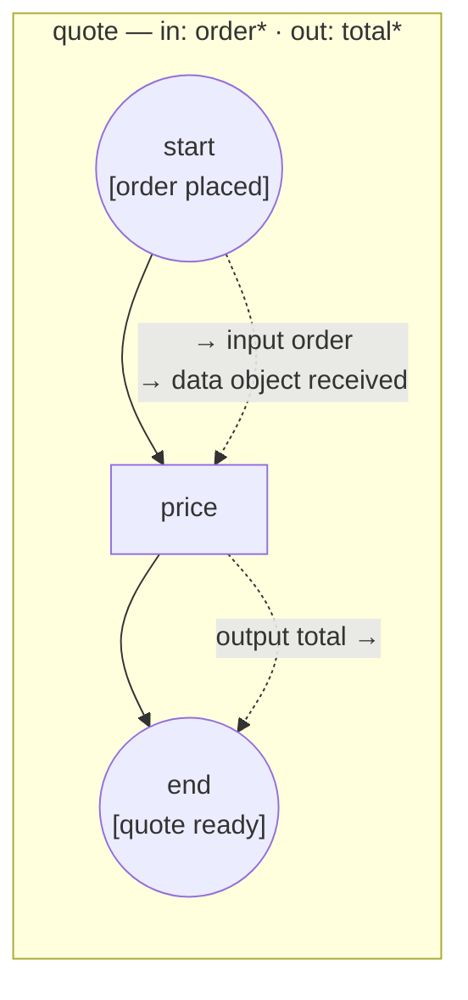

# event-data — events carry data into and out of the contract

An event's data is the standard's own way of moving a message payload: a
**catch event's output associations** push what triggered it into the
environment, a **throw event's input associations** fill what it throws
(§10.4.2). The engine wires them the way it wires a task's — through
`DataObject.AssociateSource/Target` — and, for the process's own **Start and
End Events**, into the **declared process contract**
([ADR-040 v.2 §2.7](../../docs/design/ADR-040-process-io-contract.md)): a
Start Event's output association may target a declared **input**, an End
Event's input association may source a declared **output**. That is the
Start/End special case the standard names so that a process can be entered
"from both a Call Activity and via Message Flow" — the message route fills the
same contract the call route binds.



`*` — required. The host publishes `order placed` with `ORD-2026-7`:

1. the engine creates the instance from the message; **at the seed**, before
   the contract is checked, the start's output associations copy the payload
   into the declared input `order` and into the data object `received` — a
   required input the message filled binds like a host-supplied one;
2. `price` reads both and writes `total` into the root scope;
3. at the end event, the input association fills its `quote_out` input from
   the declared output `total` — declared Unavailable and required, so only
   that association can make the throw fire — and `quote ready` is published
   with the total.

Unwire the start (`p.AssociateInput`) and the launch is refused before the
instance exists: `required input "order" is unbound at launch`.

`process.go` declares the contract, the two messages and the three wirings,
`handlers.go` holds the `price` operation, `main.go` wires the broker and
runs the round trip.

```bash
go run .
```

```
  → published "order placed" with payload "ORD-2026-7"
  ▶ price: order="ORD-2026-7" (received="ORD-2026-7") → total=100
  ← received "quote ready" with payload 100
  ✓ the message route filled the contract and carried its output back
```

The same shapes import from BPMN XML — a bare `<dataOutput>` on a catch, a
bare `<dataInput>` on a throw, and their associations to data objects or to
the process's `<ioSpecification>` parameters — see
[`docs/guides/extending/converters.md`](../../docs/guides/extending/converters.md).
