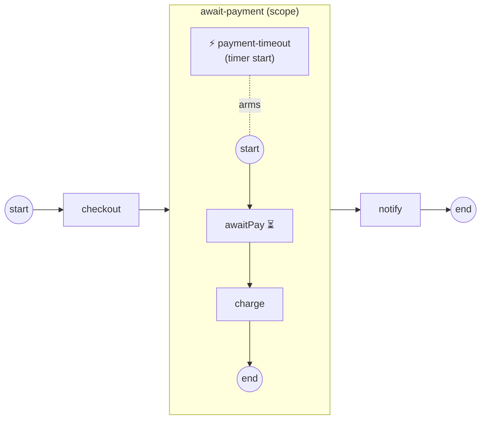

# event-subprocess

**Composition: an interrupting Event Sub-Process** — a scope-armed handler
(ADR-023 v.2 / SRD-052).

An Event Sub-Process is a `SubProcess` marked `triggeredByEvent` that lives
**inside** another scope. It is not entered by a token: it is **armed** while
its enclosing scope is open and fires when its triggered start catches an
event — the boundary-event pattern lifted from an activity's window to a
scope's window.

Here the `await-payment` scope blocks on a payment message that never
arrives. A Timer-triggered handler is armed alongside it; when the timer
fires it:

- **cancels** the enclosing scope's blocked work (`awaitPay`), the scope's
  data plane staying open so the handler runs in the parent's data context;
- **runs its own flow** (`releaseHold`) in a fresh child scope seeded from
  the triggered start;
- **absorbs** the event — reaching its End without re-throwing, so the parent
  resumes on its **normal** flow (`notify`) rather than a boundary path.

The interrupting handler is default (BPMN §13.5.4); `WithNonInterrupting`
flips it. A handler can also be triggered by Message, Signal, Error (caught on
the scope chain), or a Conditional start.



`model.go` builds the process + handler, `process.go` the tasks/timer,
`observer.go` prints the scope + handler lifecycle, `main.go` wires + runs.

```bash
go run .
```

```
  checkout
  ▶ scope await-payment: Opened
  ⚡ handler payment-timeout: Armed
  ⚡ handler payment-timeout: Fired
  ▶ scope payment-timeout: Opened
  ⚡ handler payment-timeout: Disarmed
  releaseHold
  ▶ scope payment-timeout: Completed
  ▶ scope await-payment: Completed
  notify
  ✓ completed (Completed)
```

See [`docs/guides/composition.md`](../../docs/guides/composition.md).
