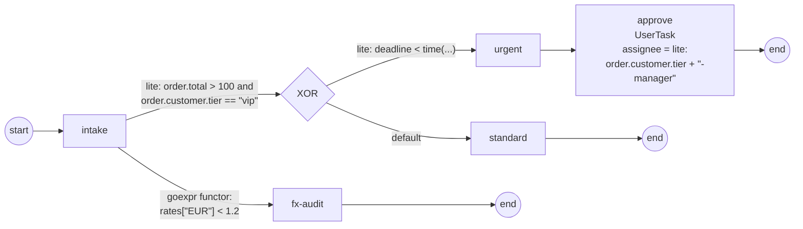

# expression-routing

Demonstrates the **language-routed expression layer** (ADR-032 /
SRD-066 / SRD-067) at **three consumer sites in one process**, mixing
**two engines with zero extra registration** — the batteries registry
carries `##GoExpr` (`gobpm:goexpr` functors) and `##Lite`
(`gobpm:lite` text expressions) out of the box, and every expression
routes to its own engine by its language URI.

```
start → [intake] ─ lite ───→ (XOR) ─ lite ────→ [urgent] → [approve] → end
            │                  └─── default ──→ [standard] → end
            └───── goexpr ─→ [fx-audit] → end
```



The three sites:

- **Task flows (mixed engines).** `intake`'s outgoing flows carry a
  `lite.Cond` text condition — `order.total > 100 and
  order.customer.tier == "vip"` navigating a nested record — beside a
  classic `goexpr` Go functor reading `rates["EUR"]` through the same
  structural-path resolver. One selection point, two languages, each
  routed to its own engine.
- **The gateway.** The XOR branches on a lite `time()` comparison
  (`deadline < time("2026-12-31T00:00:00Z")`) with a default flow as
  the else-branch.
- **User-task authorization.** `approve`'s assignee is **computed by a
  lite string expression** — `order.customer.tier + "-manager"` →
  `"vip-manager"` — so only that actor may complete the task; the
  console driver acts as exactly that manager.

Text conditions come from the one-call constructors: `lite.Cond(body)`
declares the `bool` result the condition paths require, `lite.Expr(body)`
mints a plain `gobpm:lite` text expression (the assignee one). More
engines (FEEL, JUEL, a custom DSL) register with the repeatable
`thresher.WithExpressionEngine(...)`; claim conflicts fail construction
loud, and `thresher.WithoutDefaultExpressionEngines()` empties the
batteries for a fully explicit runtime.

## Run

```bash
cd examples/expression-routing && go run .
```

Expected output: the `intake`, `fx-audit` and `urgent` lane lines, the
auto-completed approval, and the closing `✓ expression-routing
completed` line.
