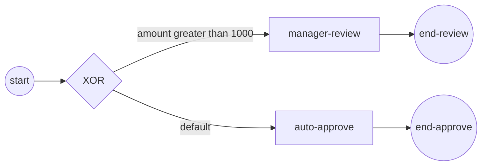

# gateway-routing

**Exclusive (XOR) data-based routing — first-true condition, else the
default flow** (ADR-005 §2.8).

- the order's `amount` property decides which **single** branch the token
  takes;
- the `amount > 1000` condition guards the manager-review flow; the
  auto-approve flow is registered as the gateway's **default flow**
  (`UpdateDefaultFlow`) and is taken only when no condition is true;
- the demo runs with `amount = 2500`, so the token routes to manager
  review.



`process.go` builds the process (the condition lives in `amountGt1000`),
`main.go` wires the engine and runs.

```bash
cd examples/gateway-routing && go run .
```

```
order amount = 2500
  ▶ amount > 1000 → routed to manager review
✓ gateway-routing completed (Completed): the exclusive gateway chose the branch by data
```
