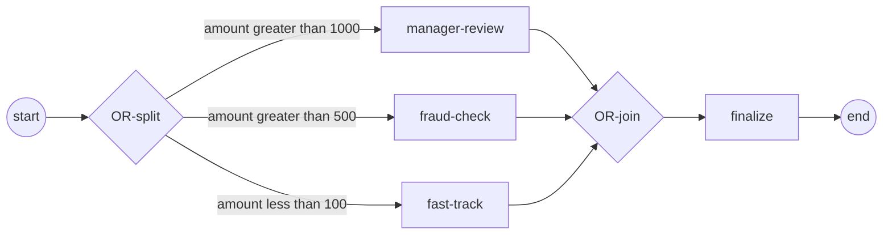

# inclusive-join

**Inclusive (OR) split — every true branch forks — and the OR-join**
(ADR-005 §2.9 / §2.10).

- the OR-split forks the **subset** of branches whose condition is true —
  not exactly one (XOR) and not all (AND);
- the converging OR-join waits for **exactly that subset** before
  continuing once;
- a never-taken branch (here `fast-track`, `amount < 100`) is found
  **unreachable** and does not stall the join;
- the demo runs with `amount = 1500` — `> 1000` and `> 500` are both true,
  so manager-review and fraud-check fork and the join merges the two.



`process.go` builds the OR diamond, `main.go` wires the engine and runs.

```bash
cd examples/inclusive-join && go run .
```

```
order amount = 1500
  ▶ amount > 1000 → manager review
  ▶ amount > 500 → fraud check
  ✓ branches merged → order finalized
✓ inclusive-join completed (Completed): the OR-join merged the active branches and fired once
```
