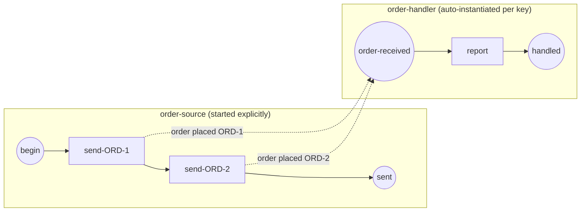

# inter-instance-correlation

**A message instantiates a handler process and correlates by a key derived
from the payload — one instance per distinct order** (ADR-015 / ADR-016
v.1, SRD-015).

- process A (`order-source`) is started explicitly and publishes two
  `order placed` messages (`ORD-1`, `ORD-2`); each SendTask stamps the
  payload-derived correlation key onto the envelope (the producer side,
  ADR-016 v.1 §2.2);
- process B (`order-handler`) has a **correlation-keyed message start
  event** and is never started explicitly — the engine instantiates one B
  per distinct order key when the message arrives (no instance exists
  before its trigger);
- two orders ⇒ two handler instances, disambiguated by the `orderId` key
  both sides derive from the same payload.



`producer.go` builds A, `consumer.go` builds B, `correlation.go` the shared
key, `main.go` wires, runs and verifies.

```bash
cd examples/inter-instance-correlation && go run .
```

```
  ✓ order "ORD-1" instantiated its own handler instance
  ✓ order "ORD-2" instantiated its own handler instance
✓ inter-instance correlation: 2 orders ⇒ 2 handler instances, routed by key
```
