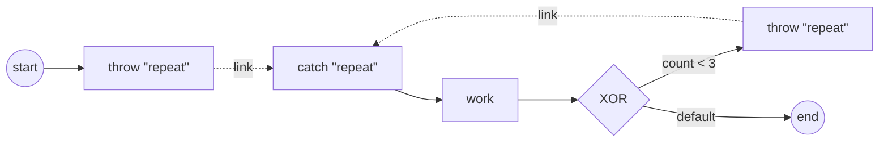

# link-events

**Link events** — an intra-process GOTO (ADR-006 v.4 §2.8 / SRD-057).

A Link is a **static, name-paired connector**: a source **Intermediate Throw**
hands the token to the same-name target **Intermediate Catch** within one
Process level. It is **not** a wait node — no broadcast, no correlation, no
subscription. The throw simply **redirects** the token to the target catch's
outgoing flow; the pairing is resolved once at snapshot build and validated at
registration (exactly one target, ≥1 source per name).

This example builds an **on-page loop** — the canonical Link use (§10.5.1
"looping situations… or to avoid long Sequence Flow lines"):



Two Link **sources** (the initial jump `throw-init` and the back-edge
`throw-back`) pair to one **target** (`catch-loop`) — **many sources → one
target**. Each pass the token redirects through the catch into `work`, which
runs until the `count < 3` condition exits to `end`. The catch is a pure flow
label: it has no incoming flow and is never independently executed (nor seeded
as a process entry) — the redirect lands the token on its downstream.

`process.go` builds the graph, `handlers.go` the work task + loop gateway,
`main.go` wires + runs.

```bash
go run .
```

Expected: three `iteration N (reached via the Link redirect)` lines, then
`completed (Completed) after 3 iterations via the Link`.
