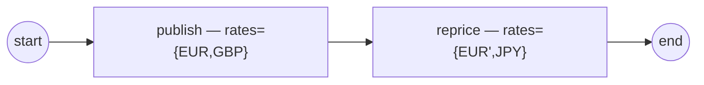

# maps

The **map value kind** — a data-keyed dictionary beside record and list
(ADR-011 v.7 §2.9.7 / SRD-047, the S5 slice).

A **map**'s keys are *data* (arbitrary run-time strings), where a **record**'s
keys are its *schema*. Maps are homogeneous, enumerate in **sorted key order**
(deterministic over Go's randomized iteration), and are addressed by the
`["key"]` path step — `[0]` still indexes a list, `["0"]` addresses the map key
`"0"`.

Two tiers navigate identically (`demo.go`):

- **dynamic** `values.Map[T]` — engine-assembled: grow it with `SetEntry`, read
  a `["key"]` path, keys come back sorted;
- **native** `map[string]V` — the host's OWN map wrapped live (`adapters.Wrap`,
  wrap-not-convert): `SetEntry` writes straight through into it.

Then a process (`process.go`) commits a rates map and re-commits a changed one;
the **commit-diff** walks it per entry and each change surfaces as a
`DataChange` fact with a `["key"]` path:

- `publish` commits `rates = {EUR, GBP}` → one `Value_Added` at the `rates` root;
- `reprice` commits `rates = {EUR', JPY}` → per entry: `rates["EUR"]` updated,
  `rates["JPY"]` added, `rates["GBP"]` deleted.



`demo.go` shows the two tiers, `process.go` builds the model, `observer.go`
filters the facts, `main.go` wires + runs.

```bash
go run .
```
