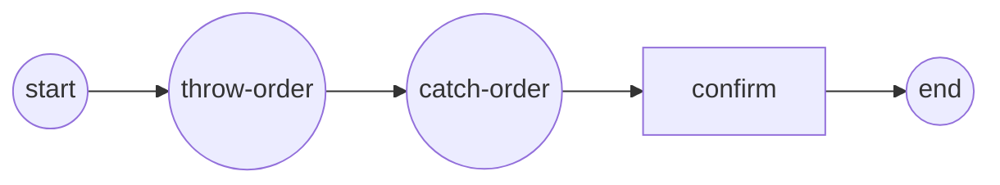

# message-intermediate-events

**Throw / catch intermediate message events** (SRD-014 / ADR-014 v.1) —
the event-shaped peers of the SendTask/ReceiveTask.

- the IntermediateThrowEvent `throw-order` reads the `order_out` property
  from scope and publishes it as the `order placed` message to the engine's
  MessageBroker;
- downstream the IntermediateCatchEvent `catch-order` waits for it (through
  a MessageWaiter) and binds the payload into scope as `order_in`;
- both events live on **one track**, so the throw completes before the
  catch subscribes — the in-memory broker buffers the published message
  until then;
- the `confirm` ServiceTask reads the bound payload and proves the
  round-trip.



Everything lives in `main.go` — model build, engine wiring and the
verification.

```bash
cd examples/message-intermediate-events && go run .
```

```
  ✓ throw-order published "ORD-2026-002"
  ✓ catch-order bound it; confirm read order_in = "ORD-2026-002"
✓ message-events-demo completed: the message travelled the broker from the throw event to the catch event
```
