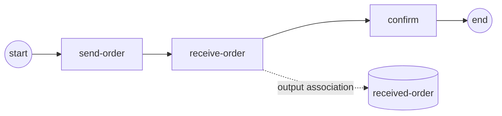

# message-send-receive

**A SendTask publishes to the broker; a ReceiveTask waits and binds the
payload** (SRD-013 / ADR-014 v.1).

- `send-order` binds the `order_out` process property and publishes it as
  the `order placed` message to the engine's MessageBroker;
- `receive-order` waits for that message through a MessageWaiter and, on
  arrival, binds the payload into scope as `order_in`;
- an **output association** lands the bound payload in the
  `received-order` DataObject, which the driver reads back to verify;
- both tasks live on **one track**, so the send completes before the
  receive subscribes — the in-memory broker buffers the message until then.



Everything lives in `main.go` — model build, engine wiring and the
verification.

```bash
cd examples/message-send-receive && go run .
```

```
  ✓ send-order published "ORD-2026-001"
  ✓ receive-order bound it into received-order = "ORD-2026-001"
✓ message-demo completed: the message travelled the broker from the SendTask to the ReceiveTask
```
