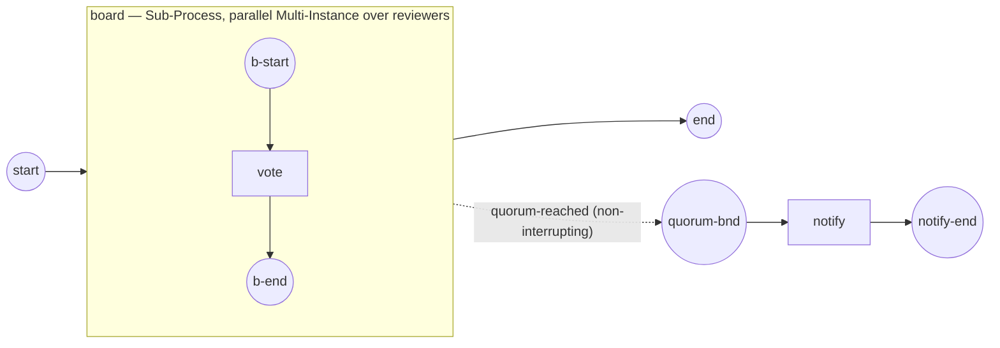

# multi-instance-behavior

Demonstrates a BPMN Multi-Instance **`behavior`** (§13.3.7, ADR-025 §2.8, SRD-056.B):
an activity throws a **boundary-catchable event** as its instances complete, so a
model can react to progress.

```
start → board [parallel Multi-Instance over reviewers] → end
        └─(non-interrupting quorum-reached boundary)→ notify → notify-end
```



`board` is a parallel Multi-Instance Sub-Process — one instance per reviewer. It
carries a **Complex** behavior: on each completion, the condition
`numberOfCompletedInstances ≥ 2` is evaluated, and when it holds a **quorum-reached**
Signal is thrown. A **non-interrupting** boundary on `board` catches that Signal and
runs a notification side-flow — the board keeps running:

```
    Cara votes                          ← concurrent: order varies run to run
    Bob votes
    Ann votes
    → quorum reached — notifying the chair   ← the 2nd completion crosses the quorum
    → quorum reached — notifying the chair   ← every completion past it throws again
  completed — the board finished; the quorum notification fired as votes crossed the threshold.
```

The throw runs on the activity's **own off-loop runner** (ADR-025 v.2 §2.12): it is
an ordinary event emit, caught on the still-armed boundary before the activity
completes — deterministically, without the loop-goroutine self-deadlock the earlier
design hit.

Run it:

```
go run .
```
