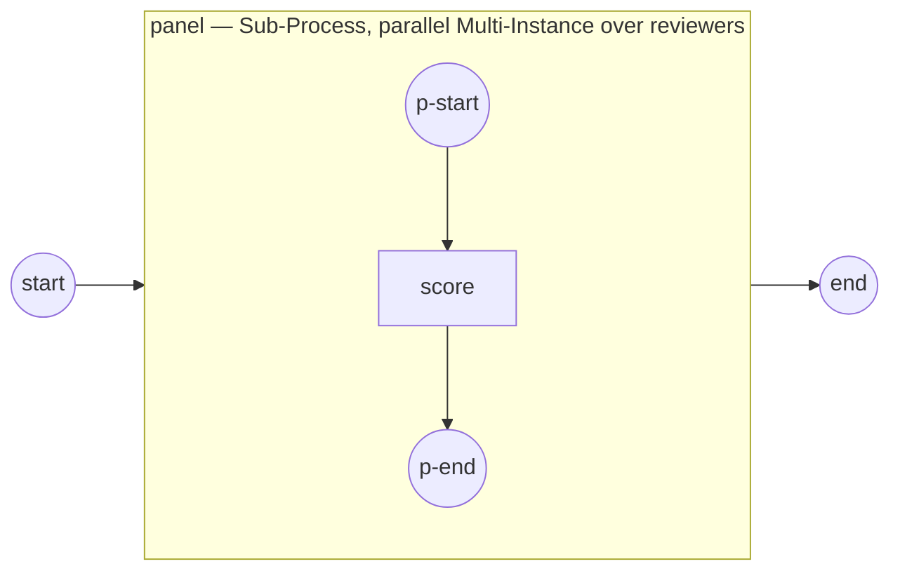

# multi-instance-parallel

Demonstrates a BPMN **parallel Multi-Instance** activity (§13.3.7, SRD-056.A): an
activity runs once per element of a collection, all instances **concurrently, in
distinct scopes**, completing when the last drains.

```
start → panel [Multi-Instance over reviewers, parallel] → end
```



`panel` is a Sub-Process marked with a **parallel** Multi-Instance (no
`WithSequential`). One instance per reviewer runs at the same time; each sees its
`reviewer` name in its own scope and assembles its `score` — positionally, by
instance ordinal — into the `scores` collection, published once every instance
completes (the visibility barrier):

```
    Bob scores the proposal: 75      ← concurrent: the print order varies run to run
    Ann scores the proposal: 70
    Cara scores the proposal: 80
    Dan scores the proposal: 85
  completed — scores: [70 75 80 85] (average 77)
```

Note the reviewers print in a **non-deterministic** order (they run in parallel),
yet `scores` is assembled in **reviewer order** — positional assembly (slot =
input ordinal) is deterministic regardless of completion order.

A `WithCompletionCondition(...)` quorum stops the panel early, **canceling** the
not-yet-finished reviewers (unlike sequential, where it only stops launching) —
observing that truncation needs asynchronous reviewers (User/external tasks), so
the instant Service Tasks here all complete first. Behavior events
(`ComplexBehaviorDefinition`) are a separate slice (SRD-056.B).

## Run

```bash
go run .
```
