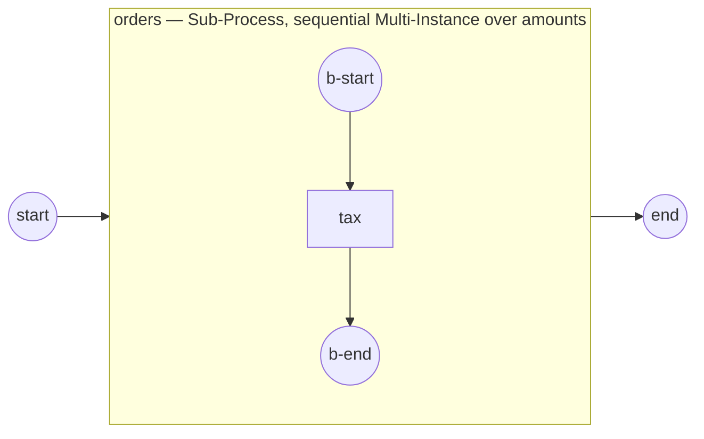

# multi-instance-sequential

Demonstrates a BPMN **sequential Multi-Instance** activity (§13.3.7, SRD-055): an
activity runs a fixed number of times — one instance per element of an input
collection — the instances running one after another.

```
start → orders [Multi-Instance over amounts, sequential] → end
```



`orders` is a Sub-Process marked with a sequential Multi-Instance. Its instance
count is fixed at activation from the `amounts` collection (`100, 250, 80`); each
instance sees its element bound as `amount`, applies 20% tax, and its `withTax`
output is assembled — in order — into the `taxed` collection, published once
every instance has completed (the visibility barrier):

```
    order: amount=100 → withTax=120
    order: amount=250 → withTax=300
    order: amount=80  → withTax=96
  completed — taxed amounts: [120 300 96]
```

The count can instead come from an integer `WithCardinality(expr)`, and
`WithCompletionCondition(expr)` stops launching the remaining instances early.
Parallel Multi-Instance is a separate slice (SRD-056).

## Run

```bash
go run .
```
