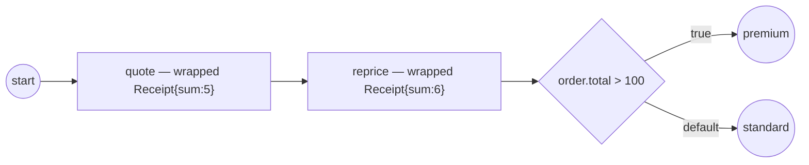

# native-structs

The host's **own Go struct as process data** — native-struct adapters
(ADR-011 v.6 §2.9.5 / SRD-045, the S4 slice).

`adapters.Wrap(&order)` returns a **live** `Record` view — wrap, not convert:

- the `gobpm:"..."` tags reconcile Go naming with process naming
  (`Total` → `total`); `gobpm:"-"` hides `Secret` from the process entirely;
- a host-side `values.SetPath(wrapped, "total", …)` writes **through the view
  into the live struct** (`o.Total` changes);
- the gateway condition `order.total > 100` reaches **into the host's struct**
  through the ordinary data seam — zero engine change;
- the tasks commit **wrapped** `Receipt` instances, and the commit-diff reports
  per-path `DataChange` facts over them (`Value_Added receipt`,
  `Value_Updated receipt.sum`).

Reflection runs **once per type**, at the first `Wrap`, cached — field access
afterwards is a cached-index accessor. A type you can't modify plugs in via
`adapters.Register[T]` (the Marshaler-analog seam); a type implementing
`data.Value` itself participates as-is.



`process.go` holds the host types + the model, `observer.go` the DataChange
printer, `main.go` the wrap + live write + run.

```bash
go run .
```

```
  SetPath(order.total=150) → the LIVE struct: o.Total == 150
  quote → commit wrapped Receipt{Sum:5}
  reprice → commit wrapped Receipt{Sum:6}
  ▶ Value_Added receipt @quote
  ▶ Value_Updated receipt.sum @reprice
  ▶ order.total > 100 → premium lane
  ✓ completed (Completed)
```

See also [`../structural-data/`](../structural-data/) (read by path),
[`../structural-output-mapping/`](../structural-output-mapping/) (assemble by
path), and [`../data-change/`](../data-change/) (detect the change) — this
example completes the structural-data quartet: the host's own types.
