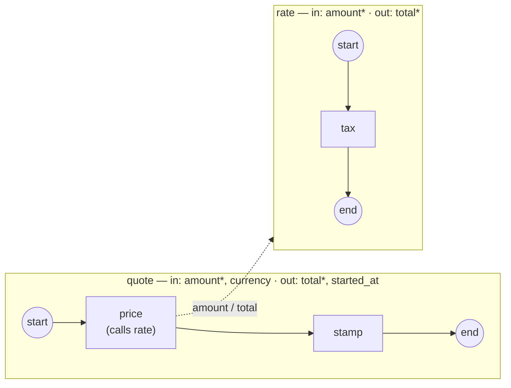

# process-io — the process declares its inputs and outputs

A process can carry an `<ioSpecification>` of its own: the **Process I/O
contract** ([ADR-040](../../docs/design/ADR-040-process-io-contract.md)).
Declared **inputs** are bound at launch — by a host through
`thresher.WithStartInput(s)`, or by a Call Activity through its parameters —
and a required input nobody supplied, or a datum the contract does not name,
**refuses the launch before the instance exists**. Declared **outputs** are
read from the root scope at normal completion: a required one that was never
produced faults the instance, and the collected result is what the host reads
from `InstanceHandle.Outputs()` or the caller commits back to its scope.



`*` — required. The host launches `quote` three times:

1. with `amount=100` and the optional `currency` — the call binds `amount`
   into the child's declared input, `tax` produces `total`, `stamp` reads it
   back and publishes the engine's `RUNTIME/STARTED_AT` under the declared
   `started_at` output (a runtime variable never leaves an instance on its
   own — a task maps it into a declared name); the handle returns both;
2. with nothing — refused: `amount` is required and unbound;
3. with `discount=5` — refused: the contract does not declare `discount`.

`process.go` declares both contracts, `handlers.go` holds the two Go
operations, `launch.go` runs the three launches, `check.go` asserts the
result, `main.go` wires + runs.

```bash
go run .
```

```
    (rate) amount=100 → total=120
  ✓ quote sees total=120
  ← output total = 120
  ← output started_at = 2026-08-26 …
  ✓ completed (Completed)

  ✗ refused (no amount): … required input "amount" is unbound at launch …
  ✗ refused (undeclared discount): … declares no input "discount" … (declared inputs: amount, currency)
```

The same contract imports from BPMN XML — `<ioSpecification>` directly under
`<process>` — see
[`docs/guides/extending/converters.md`](../../docs/guides/extending/converters.md); the data model behind the parameters is in [`docs/guides/data/`](../../docs/guides/data/index.md).
