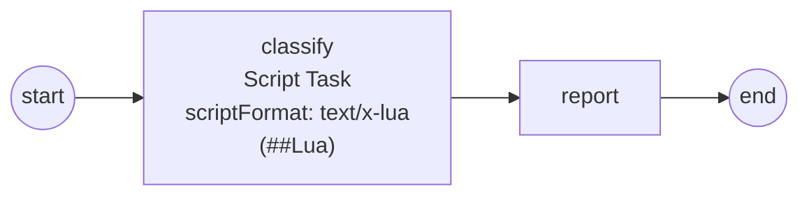

# script-task

Demonstrates the **Script Task** on the **multi-engine Script Engine seam**
(ADR-031 / SRD-064) with the batteries **Lua interpreter**
(`adapters/lua`, SRD-065): a plain `.lua` file — embedded, editable
without recompiling — runs sandboxed per order, routed by the task's own
`scriptFormat` MIME hint.

```
start → [classify (ScriptTask: text/x-lua)] → [report] → end
```



The script ([`order.lua`](order.lua)) shows the whole contract:

- **lazy, fail-loud reads** — `data.total` resolves through the process
  data walk-up on access; a typo'd name fails the task loud (no silent
  nil), and `has("tier")` probes optional data explicitly;
- **outputs by returning a table** — `discount_pct` and `lane` commit as
  named process data the downstream `report` task reads (Lua numbers land
  as `float64`);
- **the sandbox** — only base/table/string/math are loaded; `io`/`os` and
  the load family don't exist inside the script; execution is bound to
  the task context (a hung script aborts on cancellation/timeout).

The engine registers with one line — `thresher.WithScriptEngine(lua.New())`
— and the option is **repeatable**: more interpreters (a Starlark sibling,
a custom DSL) coexist in the same gobpm engine, each owning its formats,
with claim conflicts rejected loudly at construction.

Three order profiles classify to 25% (vip+big), 15% (big) and 5% (the
`has()` fallthrough — no `tier` datum declared at all).

## Run

```bash
cd examples/script-task && go run .
```

Expected output: a `[script] … -> N%` line from Lua's `print` and the
matching `[report]` line per order.
