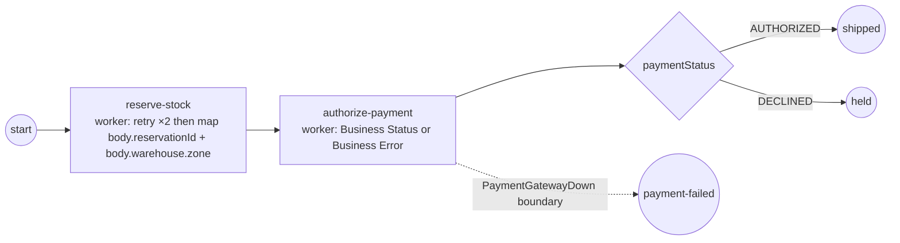

# service-task-worker — external workers, trust, retries, mapping & status

A worked order-fulfillment process that exercises the whole external-worker
execution model (ADR-021, SRD-035…039): a `ServiceTask` dispatched to a **local
pool worker**, run in the default **`WorkerTrusted`** mode, showing every worker
outcome and the "the Instance takes only final results" principle.

## What it demonstrates

| Feature | Where | SRD |
|---|---|---|
| Dispatch a `ServiceTask` to an external worker | `WithWorker("reserve")` / `("authorize")` | SRD-036 |
| **`WorkerTrusted`** default — the worker runs its policy in-process and reports a verdict | no `WithWorkerTrust` set → resolves to `WorkerTrusted` | SRD-039 M9/M10 |
| **In-process retry** of a transient technical fault (backoff, holding the lock, no re-enqueue) | `reserve` worker fails twice then succeeds; `WithRetryPolicy(FixedDelay(3, 300ms))` | SRD-038 / SRD-039 M10 |
| **Structural output mapping** — extract **nested** fields from the worker's structured body by path, off the track | `reserve` worker returns `{reservationId, warehouse:{id, zone}}`; `WithOutputMapping` reads `body.reservationId` → `reservationId` and `body.warehouse.zone` → `warehouseZone` | SRD-037 / SRD-039 M8 · ADR-011 v.6 §2.9 / SRD-042 |
| **State, not errors** — a Business **Status** the worker reports instead of throwing | `authorize` worker returns `WorkerError{Status: "AUTHORIZED"/"DECLINED"}`; `WithStatus("paymentStatus")` | SRD-037 §2.6 |
| Route on the status (non-interrupting) | exclusive gateway on `paymentStatus` | — |
| **Business Error** — an interrupting fault caught by an Error boundary | `authorize` worker returns `WorkerError{BpmnErrorCode: "PaymentGatewayDown"}` | SRD-037 FR-4 / ADR-018 |
| **Technical fault** — a raw error the worker's fallback `ErrorMapper` classifies / retries | a plain `error` from a handler | SRD-038 |

The four worker outcomes (ADR-021 §2.6) — **Complete** (+ mapping), **Business
Status**, **Business Error**, **Technical fault** — all appear, and in every case
the Instance/track see only the *final* verdict; the retries and classification
happen in the worker, off the track.

## The process



- **reserve-stock** (`WithWorker`, `WithOutputMapping`, `WithRetryPolicy`): the
  worker simulates a flaky inventory service — it fails transiently on the first
  two attempts (a plain technical error) and succeeds on the third, returning a
  **structured** `{reservationId, warehouse:{id, zone}}` receipt body. Under
  `WorkerTrusted` the pool worker **retries in-process** (300 ms backoff, holding
  its lock) and then the output mapping **reaches into the structured body by
  path** — `body.reservationId` → `reservationId` and `body.warehouse.zone` →
  `warehouseZone` (ADR-011 v.6 §2.9) — so the Instance receives the successful,
  already-shaped completion.
- **authorize-payment** (`WithWorker`, `WithStatus`, Error boundary): the worker
  inspects the order amount and reports a **verdict**:
  - amount < 0 → a Business **Error** `PaymentGatewayDown` → the boundary
    interrupts to *payment-failed*;
  - amount > 1000 → a Business **Status** `DECLINED` → the gateway routes to
    *held*;
  - otherwise → a Business **Status** `AUTHORIZED` → the gateway routes to
    *shipped*.

## What it runs

`main` starts **three** instances to walk all paths (each first shows
reserve-stock retrying + mapping):

| Order | amount | authorize verdict | ends at |
|---|---|---|---|
| normal | 50 | Business Status `AUTHORIZED` | shipped |
| over-limit | 5000 | Business Status `DECLINED` | held |
| gateway-down | -1 | Business Error `PaymentGatewayDown` | payment-failed |

### Expected output

```
  service-task-worker (WorkerTrusted):
    start → reserve-stock → authorize-payment → «paymentStatus» gateway / boundary

order-normal (amount 50):
  reserve attempt 1: inventory timeout — worker retries in-process…
  reserve attempt 2: inventory timeout — worker retries in-process…
  reserve attempt 3: reserved (reservationId=R-1001, zone=A-3)
  authorize: AUTHORIZED (Business Status)
  ✓ completed (Completed) → shipped [paymentStatus=AUTHORIZED, reservationId=R-1001, warehouseZone=A-3]

order-over-limit (amount 5000):
  reserve attempt 1: inventory timeout — worker retries in-process…
  reserve attempt 2: inventory timeout — worker retries in-process…
  reserve attempt 3: reserved (reservationId=R-1002, zone=A-3)
  authorize: DECLINED (Business Status)
  ✓ completed (Completed) → held [paymentStatus=DECLINED, reservationId=R-1002, warehouseZone=A-3]

order-gateway-down (amount -1):
  reserve attempt 1: inventory timeout — worker retries in-process…
  reserve attempt 2: inventory timeout — worker retries in-process…
  reserve attempt 3: reserved (reservationId=R-1003, zone=A-3)
  authorize: PaymentGatewayDown (Business Error) → boundary
  ✓ completed (Completed) → payment-failed (Business Error caught by the boundary)
```

## How it wires the worker

The example builds its own in-process dispatcher, registers the two handlers, and
hands it to the engine:

```go
disp := localdispatcher.New(nil, 0)
_ = disp.RegisterWorker(ctx, "reserve", reserveWorker())
_ = disp.RegisterWorker(ctx, "authorize", authorizeWorker())

engine, _ := thresher.New("order-engine", thresher.WithWorkerDispatcher(disp))
```

No trust mode is configured, so every task resolves to `WorkerTrusted` (the
ADR-021 default) — the workers self-classify (returning a `tasks.WorkerError` to
declare a Business Error or Status, or a plain `error` for a technical fault) and
retry technical faults in-process. Set `activities.WithWorkerTrust(tasks.EngineAuthoritative)`
on a task (or `thresher.WithWorkerTrustDefault(...)` engine-wide) to flip it: the
worker then returns raw and the **engine** classifies + retries by re-enqueue.

## Running

```bash
cd examples/service-task-worker
go run .
```
