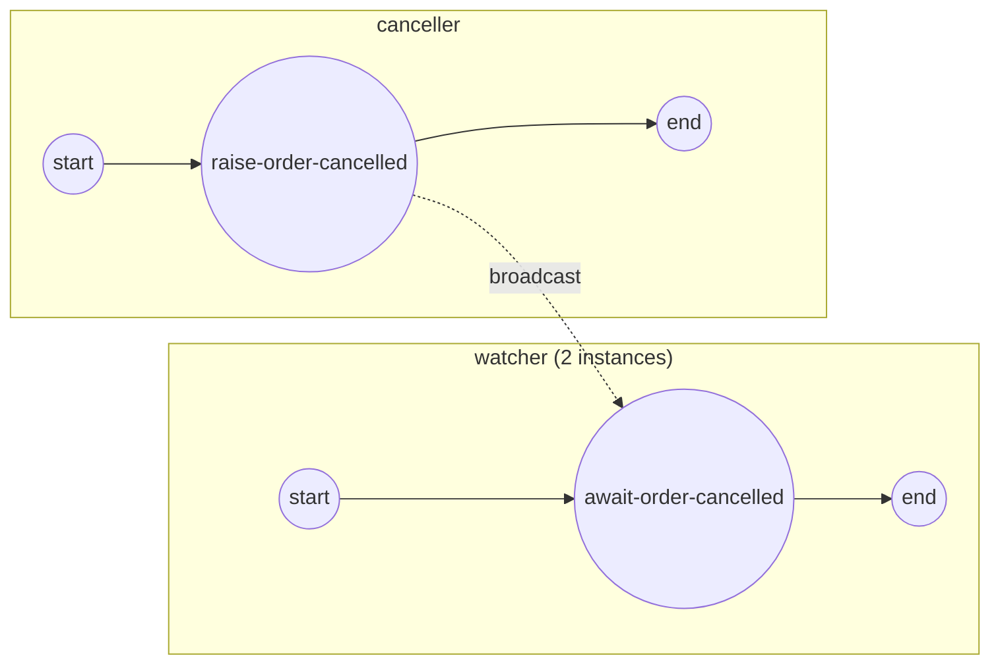

# signal-broadcast

**One thrown signal is caught by EVERY waiting catcher, across independent
instances** — signal broadcast (ADR-006 §2.1).

Two instances of the `watcher` process each park on an intermediate catch of
the signal `order-cancelled`; a single `canceller` instance throws it once and
BOTH watchers resume:

- a signal has **no correlation** — one throw broadcasts to every catcher in
  reach;
- catcher and thrower each build their **own** `SignalEventDefinition`
  (distinct nodes) — they meet by signal **name**;
- the watchers wait on an **Intermediate Catch Event**; the canceller throws
  via an **Intermediate Throw Event**.



`process.go` builds both processes, `main.go` wires + runs.

```bash
cd examples/signal-broadcast
go run .
```

```
  ▶ two watcher instances are waiting on "order-cancelled"
  ▶ one canceller threw the signal once
  ✓ watcher 1 completed (Completed) — caught the broadcast
  ✓ watcher 2 completed (Completed) — caught the broadcast
✓ one throw → every waiting instance caught it (broadcast)
```
