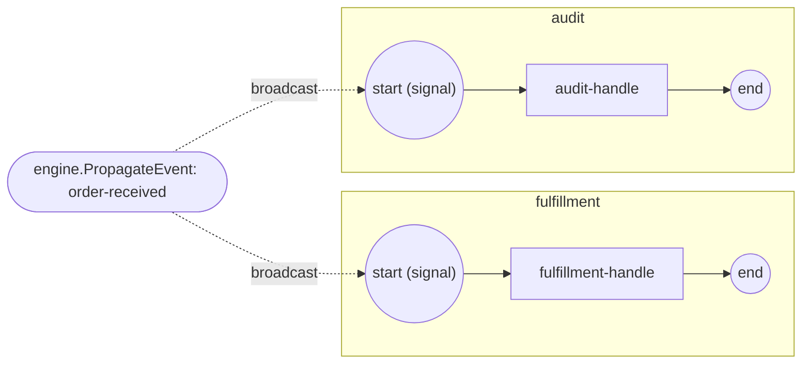

# signal-start

**A broadcast signal CREATES process instances — no StartProcess call.**

Both `fulfillment` and `audit` are registered with a **signal Start Event** on
`order-received` (no incoming flow). One broadcast of the signal instantiates
BOTH processes:

- the Start Event carries a signal trigger (`events.WithSignalTrigger`);
- the broadcast comes from `engine.PropagateEvent` — signals are broadcast,
  not point-to-point, so every registered process starting on that name gets
  its own instance;
- signal-born instances have no StartProcess handle — `observe.go` discovers
  them via `engine.Instances` and waits for their completion.



`process.go` builds the signal-started processes, `observe.go` tracks the
signal-born instances, `main.go` wires + runs.

```bash
cd examples/signal-start
go run .
```

```
  ▶ broadcasting "order-received" once (no StartProcess call)...
  order-received → handling fulfillment
  order-received → recording audit
✓ one broadcast signal created and completed both instances
```
