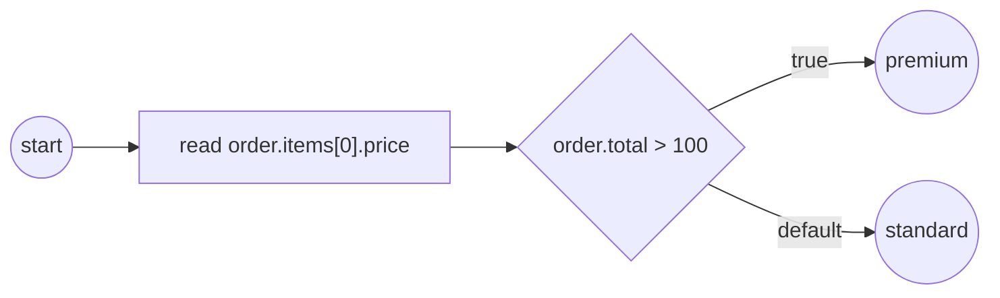

# structural-data

Reaching **into** a structural value by path (ADR-011 v.6 §2.9 / SRD-042 S1).

The `order` property is a **record** — `{id, total, items:[{sku, price}]}` — and
two different consumers address into it through the **one** data-access seam:

- a **service task** reads `order.items[0].price` via the narrow `DataReader`;
- an **exclusive gateway** routes on the condition `order.total > 100`.

Neither needs a special API: `.field` descends into a record, `[i]` into a list,
resolved by the same `Source.Find` that plain names and `SOURCE/addr` providers
use (the `/` provider split still runs first; `.`/`[]` navigate engine-managed
values).



`process.go` builds the model, `main.go` wires + runs.

```bash
go run .
```

```
  ▶ order.items[0].price = 50
  ▶ order.total > 100 → premium lane
✓ structural-data completed (Completed)
```

See also [`../service-task-worker/`](../service-task-worker/) for structural
**output mapping** — a worker returns a structured body and mapping rules extract
nested fields (`body.warehouse.zone`).
