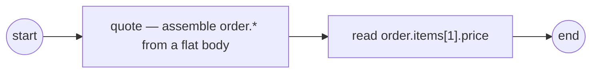

# structural-output-mapping

Assembling a nested value **out of** a flat worker body (ADR-011 v.6 §2.9.5 /
SRD-043 S2, the write path).

The `quote` worker returns a **flat** body — `{total, price0, price1}`, no nesting
at all. The nesting is the *task's* job: three `WithOutputMapping` rules share the
head `order`, so instead of three flat variables the mapping **assembles one**
`order` record —

- `order.total` ← `body.total` (a record field),
- `order.items[0].price` ← `body.price0`,
- `order.items[1].price` ← `body.price1` (the `items` list is **auto-vivified** and
  grown by `SetPath`).

A downstream service task then reads `order.items[1].price` back through the same
`DataReader` seam — proof the flat body became one navigable nested value.



`worker.go` is the flat-body handler, `process.go` builds the model, `main.go`
wires + runs.

```bash
go run .
```

```
  quote worker → flat body {total:150, price0:50, price1:100}
  ▶ order.items[1].price = 100
  ✓ completed (Completed)
```

See also [`../structural-data/`](../structural-data/) for the read path — reaching
**into** a structural value by the same `.field` / `[i]` grammar.
