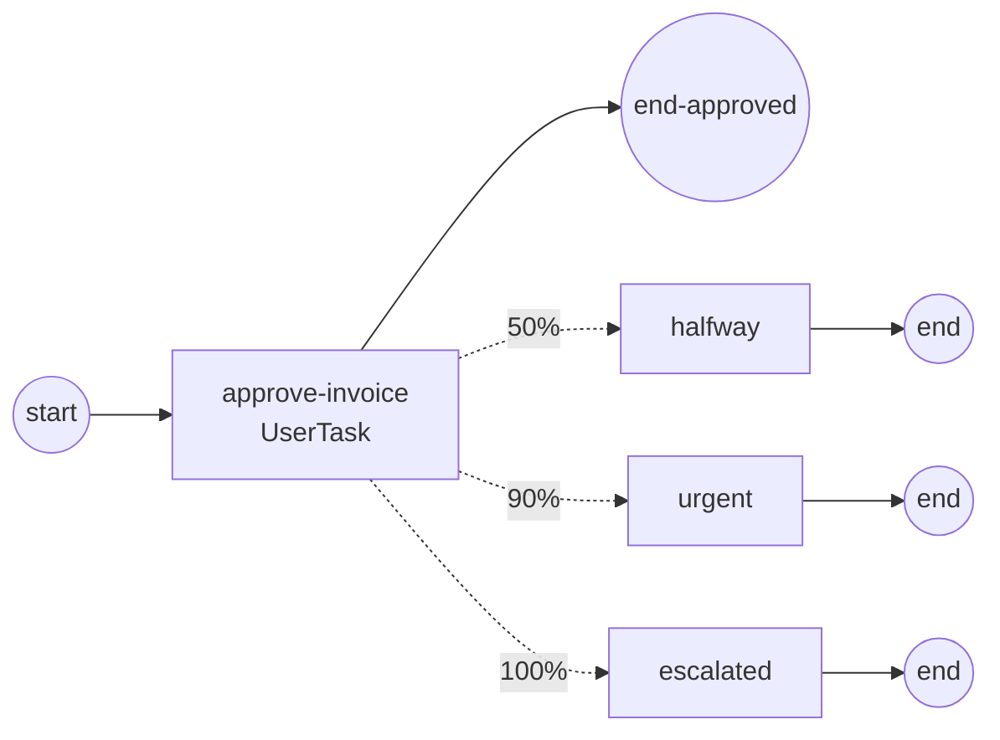

# usertask-sla — SLA warnings on a human task

Three **bounded, non-interrupting** timer boundaries watch a UserTask's clock
and fire at 50%, 90% and 100% of its budget. The approval deliberately
overruns, so all three fire — and the task still completes.



## What it demonstrates

**`timeDuration` alone.** Each boundary carries a relative deadline —
`NewTimerEventDefinition(nil, nil, after)` — measured from the moment the
boundary arms. Before SRD-077 this could not be expressed: the constructor
required a `timeCycle` beside it, so relative timers had to be faked with a
date expression computing `time.Now().Add(d)` at evaluation time (as
`examples/boundary-events` still does). That workaround bypasses the engine's
injected `Clock`; this does not.

**Three separate timers, not one recurrence.** 50/90/100 is not a uniform
interval, so no cycle can express it. Each mark is its own bounded timer with
its own deadline.

**Non-interrupting is the whole point.** Each warning forks a parallel token
and leaves the approval running. An *interrupting* boundary would cancel the
very work it was warning about — the run asserts the instance reaches
`Completed`, which is what proves the guarded task survived all three.

## Run it

```bash
go run .
```

```
  ⏳ operator received the invoice, will take 2.4s over it
  ⏰ 50% of the SLA is gone — the approval is still open
  ⏰ 90% of the SLA is gone — this needs attention now
  ⏰ SLA breached — escalating to the supervisor
  ✓ operator approved the invoice — late, but approved

process finished: Completed (SLA marks fired: [halfway urgent escalated])
```

The run **asserts its own outcome**: all three marks fired, in
ascending-deadline order, and the instance completed. It exits non-zero
otherwise. Marks are recorded from inside the notification tasks, synchronously
with the run — engine observer facts are best-effort and asynchronous
(ADR-013), so one can still be in flight when `WaitCompletion` returns.
