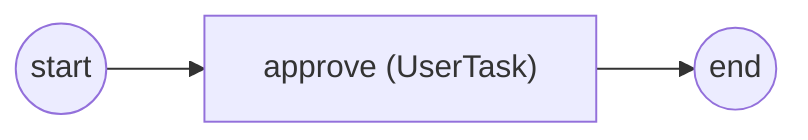

# usertask

**A UserTask driven from the console: the engine parks the task, the console
TaskDistributor Takes it, renders its form, and Completes it**, resuming the
process to its End Event.

- the `approve` UserTask is claimable by candidate user `operator` and
  collects a `decision` (string) output;
- the form is a console renderer (`consinp`) fed a scripted answer
  (`approved`), so the run needs no interactive input;
- the console driver (`pkg/interactor/console`) is passed to the engine as its
  TaskDistributor and bound back to it (`driver.Bind(th)`).



`process.go` builds the process, `main.go` wires the console driver + runs.

```bash
cd examples/usertask
go run .
```

```
process finished: Completed
```
