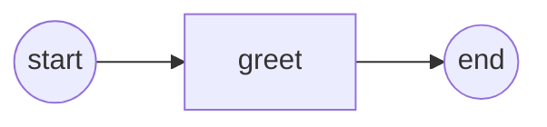

# Definition Versioning Example

Demonstrates Camunda-style definition versioning (ADR-019 / SRD-031.A): one
process **key** carries many **versions**, and each version can be addressed by
latest, by number, or by the registration handle.



The graph itself is trivial — the point is that this same `greeter` process is
built and registered **twice** under the same key (its process id), producing
versions `1` and `2` of one definition; only the label the `greet` task prints
differs between the builds.

## What it demonstrates

- Registering a process twice under the **same key** (the process id) yields
  versions `v1`, `v2`, … — not two unrelated processes.
- `RegisterProcess` returns a **`ProcessRegistration`** handle naming `(key, version)`.
- Three start modes:
  - `StartLatest(key)` — run the highest version number.
  - `StartVersion(key, n)` — pin a specific version without holding its handle.
  - `StartProcess(reg)` — run the exact version the handle names.
- `Registrations(key)` — enumerate a key's live versions.
- **Promote-on-removal**: `UnregisterVersion` of the latest promotes the
  now-newest remaining version back to latest — symmetric with how registering a
  newer version supersedes the previous one.

Each version's service task prints its own label, so the console shows exactly
which version executed for every start call.

## Running

```bash
go run .
```

## Expected output

```
  registered v1 → key="greeter" version=1
  registered v2 → key="greeter" version=2
      ▶ [v2] hello from the greeter
  StartLatest        → expects v2  [instance Completed]
      ▶ [v1] hello from the greeter
  StartVersion(key,1)→ expects v1  [instance Completed]
      ▶ [v1] hello from the greeter
  StartProcess(v1)   → expects v1  [instance Completed]
  registered versions of "greeter": [1 2]
  after UnregisterVersion(v2), versions: [1]
      ▶ [v1] hello from the greeter
  StartLatest        → expects v1 (promoted)  [instance Completed]

✓ versioning example completed
```
